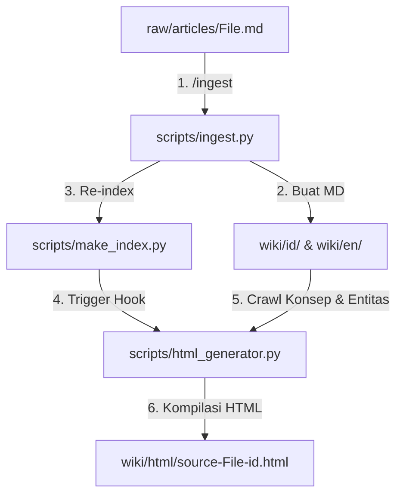

# Desain Teknis: Kapabilitas Kompilasi Dashboard HTML Interaktif (`/html`)

**Tanggal:** 2026-06-02  
**Status:** Draf Desain  
**Domain:** Rekayasa Antarmuka Agen / Obsidian Wiki  
**Bahasa Output HTML:** Bahasa Indonesia (100% Terjemahan Presisi)

---

## 1. Pendahuluan & Latar Belakang

Sesuai dengan esensi artikel *"The Unreasonable Effectiveness of HTML"* oleh Thariq Shihipar (tim Claude Code), representasi dokumen panjang dalam format Markdown memiliki keterbatasan besar dalam menyajikan hierarki informasi yang rumit, diagram relasi, dan interaktivitas dua arah. 

Desain ini menambahkan kapabilitas `/html` ke dalam vault LLM Wiki dengan menyediakan script kompilator `scripts/html_generator.py`. Script ini merayapi (*crawls*) file mentah (*raw*), ringkasan bilingual terkompilasi, serta entitas dan konsep yang saling berhubungan, lalu menggabungkannya ke dalam **satu file Dashboard HTML Bahasa Indonesia mandiri (self-contained)** berestetika premium dengan interaktivitas tinggi.

---

## 2. Struktur Direktori & Aliran Integrasi

### 2.1. File Baru dan Modifikasi
- `[NEW]` `scripts/html_generator.py`: Script inti generator HTML dashboard.
- `[NEW]` `wiki/html/`: Direktori penyimpanan terpusat untuk Dashboard HTML yang dihasilkan.
- `[MODIFY]` [scripts/ingest.py](file:///c:/Users/mifta/Documents/Obsidian%20Vault/remote-blog/01-TODO/2026/My-Wiki/scripts/ingest.py): Penambahan hook otomatis di akhir `main()` untuk memicu `html_generator.py` setelah setiap kali ingest berhasil.
- `[MODIFY]` [scripts/make_index.py](file:///c:/Users/mifta/Documents/Obsidian%20Vault/remote-blog/01-TODO/2026/My-Wiki/scripts/make_index.py): Perbaikan pembuatan indeks agar mendeteksi file HTML di `wiki/html/` dan menambahkannya ke katalog utama Bahasa Indonesia.



---

## 3. Spesifikasi Teknis CLI & Integrasi

### 3.1. Parameter CLI
Script `scripts/html_generator.py` menerima parameter masukan berupa path file raw:
```bash
python scripts/html_generator.py raw/articles/The-Unreasonable-Effectiveness-Of-HTML.md
```

### 3.2. Logika Resolusi Sumber & Crawling Relasi
1. Script mengekstrak nama dasar (*basename*) dari file raw (contoh: `The Unreasonable Effectiveness Of HTML`).
2. Script memverifikasi keberadaan ringkasan Bahasa Indonesia di `wiki/id/sources/source-the-unreasonable-effectiveness-of-html-id.md`. 
   - Jika file ringkasan belum ada, script akan memanggil `python scripts/ingest.py <raw-file>` secara otomatis.
3. Membaca metadata YAML dan isi ringkasan Bahasa Indonesia. Menggunakan ekspresi reguler `\[\[(.*?)\]\]` untuk memilah dan mengekstrak semua tautan konsep dan entitas Bahasa Indonesia.
4. Mencari file konsep terasosiasi di folder `wiki/id/concepts/<domain>/<name>-id.md` dan file entitas di `wiki/id/entities/<domain>/<name>-id.md`.
5. Mengumpulkan seluruh data teks Markdown, lalu memulai tahap rendering HTML.

---

## 4. Desain Antarmuka Visual & Interaktivitas HTML

File HTML yang dihasilkan adalah sebuah Single-Page Application (SPA) mandiri tanpa *framework* JavaScript luar, menggunakan CSS murni yang estetis dan interaktif.

### 4.1. Panduan Desain CSS (Estetika Premium)
- **Tema Gelap Default (Glassmorphism):**
  - Warna Dasar: `#080c14` (Deep Slate Obsidian)
  - Card/Panel: `rgba(17, 24, 39, 0.7)` dengan `backdrop-filter: blur(12px)` dan border tipis mengkilap `1px solid rgba(255, 255, 255, 0.08)`.
  - Warna Aksen: Neon Cyan `#00f2fe` untuk status aktif/fokus dan Electric Purple `#a855f7` untuk entitas/hiasan sekunder.
- **Tipografi:** Google Fonts `Inter` (teks utama) dan `Outfit` (untuk tajuk).
- **Tata Letak:** Menggunakan Flexbox dan Responsive Grid CSS.

### 4.2. Arsitektur Tab Antarmuka
1. **Tab 📊 Ringkasan Sumber:** Menyajikan deskripsi komparatif dari dokumen asli, metadata SHA-256, tag, serta tanggal pembuatan dalam format grid info yang elegan.
2. **Tab 📄 Artikel Mentah:** Kontainer teks Markdown asli dengan opsi pembacaan yang nyaman.
3. **Tab 💡 Konsep Terkait:** Grid kartu konsep Bahasa Indonesia. LaTeX matematika dirender rapi menggunakan pustaka MathJax CDN yang dimuat secara asinkron.
4. **Tab 👥 Entitas Terkait:** Grid kartu entitas dengan badge kategori person/organization/tool/software.
5. **Tab 🎛️ Ruang Bermain (Sandbox Parameter & Animasi):**
   - Simulator parameter interaktif: Slider Vanilla JS untuk mengubah ukuran font artikel live (`14px` - `22px`) dan lebar wadah konten (`600px` - `1000px`).
   - Widget Tombol Kustom: Widget demo tombol HTML dengan parameter durasi transisi kustom yang dapat diubah menggunakan slider (mengimplementasikan contoh kasus di artikel!).
   - Tombol ekspor cepat untuk menyalin parameter tuning sebagai string JSON ke dalam papan klip (*clipboard*).
6. **Tab 🕸️ Peta Hubungan Vektor SVG:**
   - Dinamis digambar secara pemrograman dari Python menggunakan koordinat lingkaran terdistribusi.
   - Efek hover CSS neon pada garis relasi `<line>` dan lingkaran `<circle>`.
   - Tooltip dinamis untuk deskripsi node saat diarahkan kursor.

### 4.3. Navigasi In-Page Wikilink
Tautan internal seperti `[[agent-html-artifacts-id]]` di dalam teks ringkasan atau konsep diubah menjadi pemanggilan JavaScript:
```html
<a href="javascript:void(0)" class="wiki-link" onclick="focusElement('concept', 'agent-html-artifacts-id')">distilasi-kompresi</a>
```
**Perilaku klik:**
1. Otomatis mengubah tab aktif ke tab "Konsep Terkait" atau "Entitas Terkait".
2. Menghitung posisi elemen kartu target di layar.
3. Menggulir layar secara mulus (*smooth scrolling*) ke kartu tersebut.
4. Memicu animasi sorot kedip (*pulsing cyan shadow highlight*) selama 1.5 detik pada kartu target agar perhatian pembaca langsung tertuju ke sana.

---

## 5. Logika Implementasi Parser Markdown di Python

Parser Markdown kustom bawaan di `html_generator.py` diimplementasikan menggunakan pemetaan ekspresi reguler terurut:

| Pola Markdown | Ekspresi Reguler Python | Output HTML |
|---|---|---|
| Headers (H1-H4) | `r'^# (.*?)$'` s.d. `r'^#### (.*?)$'` | `<h1>...</h1>` s.d. `<h4>...</h4>` |
| Teks Tebal (Bold) | `r'\*\*(.*?)\*\*'` | `<strong>...</strong>` |
| Teks Miring (Italic) | `r'\*(.*?)\*'` | `<em>...</em>` |
| Kode Inline | `r'\`(.*?)\`'` | `<code>...</code>` |
| Blok Kode | `r'^\`\`\`(\w*)\n(.*?)\n\`\`\`$'` (re.DOTALL) | `<pre><code class="language-\1">...</code></pre>` |
| Kutipan (Quote) | `r'^>\s?(.*?)$'` | `<blockquote>...</blockquote>` |
| Paragraf (Double LF) | `r'\n\n'` | `<p>...</p>` |
| Wikilink Standar | `r'\[\[(.*?)\]\]'` | Penelusuran relasi & pembuatan `<a onclick="...">` |

---

## 6. Rencana Pengujian & Verifikasi

### 6.1. Pengujian Fungsional CLI
1. Menjalankan perintah `/html` secara langsung pada file raw yang sudah ada:
   ```bash
   python scripts/html_generator.py raw/articles/The\ Unreasonable\ Effectiveness\ Of\ HTML.md
   ```
2. Memverifikasi bahwa file `wiki/html/source-the-unreasonable-effectiveness-of-html-id.html` berhasil dibuat tanpa ada error syntax Python.

### 6.2. Uji Integrasi Pipeline Ingest
1. Membuat file raw mock baru: `raw/articles/html_test_sample.md`.
2. Menjalankan perintah ingest:
   ```bash
   python scripts/ingest.py raw/articles/html_test_sample.md
   ```
3. Memastikan di akhir log bahwa generator HTML terpanggil otomatis, dan file `wiki/html/source-html-test-sample-id.html` terbuat secara instan.

### 6.3. Verifikasi Keberfungsian Antarmuka di Browser
1. Membuka file HTML yang dihasilkan menggunakan browser (Chrome/Edge/Firefox).
2. Memastikan seluruh tab berfungsi mulus saat diklik.
3. Mencoba slider pengatur font dan lebar wadah untuk memverifikasi live rendering CSS.
4. Mengklik tautan wikilink internal di tab Ringkasan untuk memastikan tab berganti otomatis dan kartu konsep yang dituju tersorot dengan animasi kedip cyan yang memikat.
5. Memeriksa visualisasi SVG map hubungan dan tooltip data relasinya.
