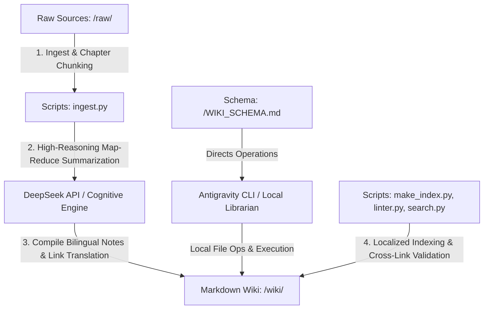

# Design Specification: Obsidian-First Integrated LLM Wiki System

**Date**: 2026-06-02  
**Author**: Antigravity  
**Status**: DESIGN SPECIFICATION (Pending User Approval)  
**System Engine**: Hybrid Architecture with Pure Local Fallback (Antigravity CLI Local Executor + Optional DeepSeek API Cognitive Engine, with 100% self-contained Antigravity CLI offline fallback)
**Language Schema**: Bilingual Parallel Vault Structure (English & Indonesian)

---

## 1. System Architecture Overview

The **Obsidian-First Integrated LLM Wiki System** is a persistent, compounding knowledge compiler built for personal use within Obsidian. It operates on a **4-Tier Model** that segments raw sources, compiled knowledge, configuration rules, and localized Python automation scripts.

To support bilingual workflows, the knowledge base is physically split into parallel **English (`wiki/en/`)** and **Indonesian (`wiki/id/`)** directories, namespaced into four primary domains: **Finance, Software Engineering, AI, and Economics**.



---

## 2. Directory Structure Specification

We will establish and enforce the following folder hierarchy in your Obsidian Vault:

```text
My-Wiki/
├── WIKI_SCHEMA.md         # Master instructions for any LLM agent (Claude/Gemini/DeepSeek)
├── raw/                   # Immutable raw source documents
│   ├── papers/            # Academic PDF papers, books, technical literature
│   ├── articles/          # Web clips, blog posts, news, standard articles
│   └── notes/             # Personal raw logs, voice transcripts, draft notes
├── wiki/                  # The compiled AI-managed Markdown Wiki
│   ├── log.md             # Unified append-only chronological log of all actions
│   ├── en/                # === English Sub-Wiki ===
│   │   ├── index.md       # Auto-generated English catalog index
│   │   ├── sources/       # Summaries of raw files written in English
│   │   ├── concepts/      # concepts/finance/, concepts/software-engineering/, etc.
│   │   └── entities/      # entities/finance/, entities/software-engineering/, etc.
│   └── id/                # === Indonesian Sub-Wiki ===
│       ├── index.md       # Auto-generated Indonesian catalog index
│       ├── sources/       # Summaries of raw files written in Indonesian
│       ├── concepts/      # concepts/finance/, concepts/software-engineering/, etc.
│       └── entities/      # entities/finance/, entities/software-engineering/, etc.
└── scripts/               # Local Python automation tools
    ├── make_index.py      # Scans wiki/ recursively and builds en/index.md and id/index.md
    ├── linter.py          # Validates backlink structure, YAML frontmatter, and translation links
    ├── search.py          # Fast local hybrid keyword/BM25 search engine
    └── deepseek_helper.py # Small helper client to handle reasoning calls via DeepSeek API
```

---

## 3. Strict Page Schemas (YAML Frontmatter)

To leverage Obsidian's database plugins (like **Dataview**) and graph view, all AI-generated wiki files must begin with a standardized YAML header containing `lang` and `translation` keys:

### 3.1. English Concept Page (e.g., `wiki/en/concepts/ai/transformer_architecture.md`)
```yaml
---
type: concept
domain: ai
lang: en
translation: "[[arsitektur_transformer]]"
tags: [deep-learning, NLP]
created: 2026-06-02
updated: 2026-06-02
sources: ["[[source-vaswani-attention-is-all-you-need]]"]
description: A deep neural network architecture based on self-attention mechanisms.
---
```

### 3.2. Indonesian Concept Page (e.g., `wiki/id/concepts/ai/arsitektur_transformer.md`)
```yaml
---
type: concept
domain: ai
lang: id
translation: "[[transformer_architecture]]"
tags: [deep-learning, NLP]
created: 2026-06-02
updated: 2026-06-02
sources: ["[[source-vaswani-attention-is-all-you-need-id]]"]
description: Arsitektur jaringan saraf dalam yang didasarkan pada mekanisme self-attention.
---
```

### 3.3. English Source Metadata Page (e.g., `wiki/en/sources/source-karpathy-llm-wiki-gist.md`)
```yaml
---
type: source
source_file: "raw/articles/llm-wiki.md"
sha256: "e3b0c44298fc1c149afbf4c8996fb92427ae41e4649b934ca495991b7852b855"
created: 2026-06-02
updated: 2026-06-02
tags: [knowledge-management, rag, agents]
---
```

---

## 4. Python Automation Scripts Specification

Local scripts are written in pure, standard Python to minimize dependencies, run extremely fast, and offload computational/bookkeeping tasks from the LLM agent.

### 4.1. `scripts/make_index.py` (The Bilingual Indexer)
- **Goal**: Read every file recursively under `wiki/en/` and `wiki/id/` separately.
- **Parsing**: Extract `type`, `domain`, `lang`, `tags`, `category`, and `description` from the YAML frontmatter.
- **Output**:
  - Rebuild `wiki/en/index.md` (in English) with headers like `## Core Concepts by Domain` (`### Finance`, `### Software Engineering`, etc.).
  - Rebuild `wiki/id/index.md` (in Indonesian) with headers like `## Konsep Inti per Ranah` (`### Keuangan`, `### Rekayasa Perangkat Lunak`, etc.).
- **Token Impact**: Saves **80-90%** of agent token consumption during indexing operations.

### 4.2. `scripts/linter.py` (The Bilingual Linter)
- **Goal**: Perform static analysis checks recursively across all subfolders.
- **Rules**:
  1.  **Broken Links**: Scans all `[[Page Name]]` links recursively.
  2.  **Translation Validation**: Verifies that if a page defines a `translation: "[[Target]]"`, the `Target` page exists and backlinks to this page as its translation.
  3.  **Frontmatter Validation**: Confirms every markdown file starts with valid YAML containing `type`, `domain`, `lang`, `created`, and `updated` keys.

### 4.3. `scripts/search.py` (Fast Local Search)
- **Goal**: Provide high-speed hybrid search across the vault recursively, supporting keyword matching in subdirectories.

### 4.4. `scripts/deepseek_helper.py` (Cognitive Client with Fallback)
- **Goal**: Interacts with the **DeepSeek API** to route complex, reasoning-heavy tasks.
- **Offline/No-API Fallback**: If the `DEEPSEEK_API_KEY` is not present, or if the API call fails or times out, this helper script returns exit code `2` (Local Fallback Mode). In this mode, all cognitive tasks (Map-Reduce chunk summarizations, integration, and contradiction handling) are handled strictly locally by the **Antigravity CLI** agent interface within the active session loop.

---

## 5. Operations & Protocols

### 5.1. The Bilingual Ingestion Protocol (`/ingest <source-file>`)
1.  **Pre-Process**: Local script calculates SHA-256 checksum of `<source-file>`.
2.  **Chunk (If Large)**: If the document exceeds 10,000 words, split it into structural chunks using `scripts/ingest.py`.
3.  **Map-Reduce Summarization**:
    - **Mode A (With DeepSeek API)**: Calls the DeepSeek API sequentially to extract summaries in both English and Indonesian.
    - **Mode B (Pure Local Fallback)**: The local Python script skips external API calls and outputs chunk details locally. The **Antigravity CLI** agent intercepts this state, reads the chunks sequentially using vault tools, performs the map-reduce summarization directly inside the active chat conversation, and writes parallel summaries.
4.  **Integrate Knowledge**:
    - Map the extracted concepts and entities to their corresponding domains (**Finance, Software Engineering, AI, Economics**).
    - Write parallel pages under their respective language paths (e.g. `wiki/en/concepts/ai/` and `wiki/id/concepts/ai/`).
    - Attach the cross-linking `translation:` properties.
5.  **Compile Logs**: Append a chronological record to `wiki/log.md`.
6.  **Re-Index**: Execute `python scripts/make_index.py` locally to automatically compile the changes into both `wiki/en/index.md` and `wiki/id/index.md`.

---

## 6. Verification Plan

### 6.1. Automated Tests
We will build a simple suite to verify:
1.  `scripts/make_index.py` correctly generates both English and Indonesian `index.md` files with links that work.
2.  `scripts/linter.py` correctly flags broken links, orphan pages, and translation mismatches recursively.
3.  `scripts/search.py` returns correct ranked pages in subdirectories for a sample term.

### 6.2. Manual Verification
1.  Open Obsidian and check the Graph View to ensure interlinking works seamlessly across all four subdirectories.
2.  Inspect `wiki/index.md` in Obsidian to confirm category sections are rendered correctly as standard Markdown.
