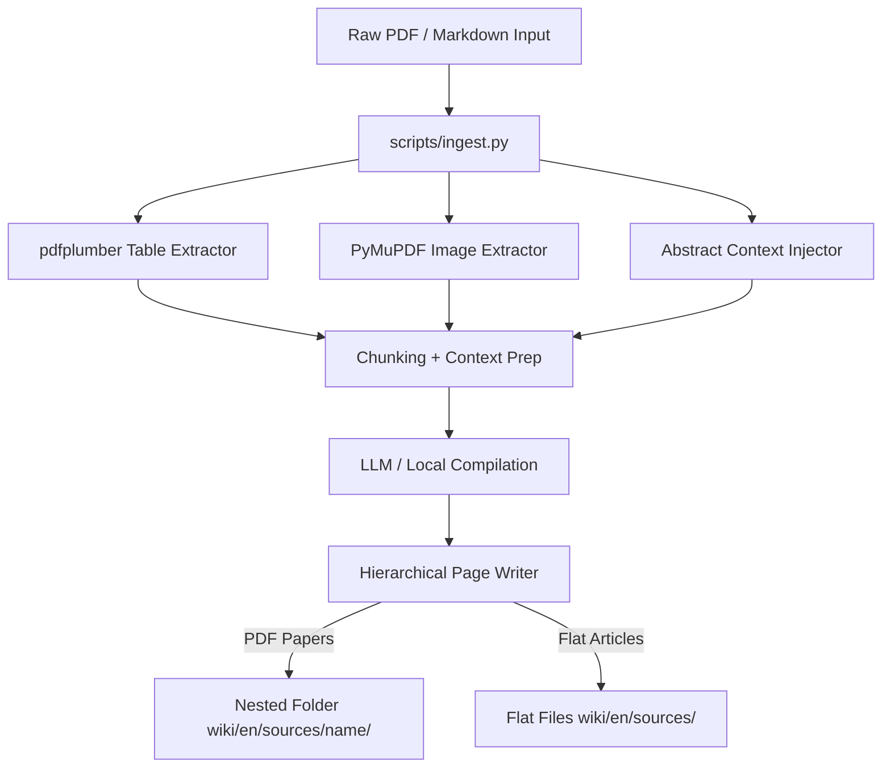

# Design Specification: Deep Ingest Pipeline Optimization

- **Date**: 2026-06-03
- **Status**: APPROVED
- **Author**: Antigravity (AI Coding Assistant)
- **Topic**: Upgrading the LLM Wiki Ingestion Pipeline to support deep technical extraction and layout preservation of academic papers.

---

## 1. Objective & Scope

The current ingestion pipeline (`scripts/ingest.py`) compiles raw sources into a flat markdown summary with a few concept/entity pages. When processing dense academic papers (e.g. 15-30 page PDFs), this lossy summarization filters out critical engineering details:
1.  **Format Destruction of Tables**: High-density numerical data (such as benchmark rankings and ablation metrics) is flattened into unreadable text lines.
2.  **Loss of Diagrams/Figures**: Key visual architectures are ignored.
3.  **Context Drift in Chunking**: Chunking text in isolation causes the LLM to lose the paper's main abstract/goal.
4.  **Absence of Technical Specifications**: Crucial training details (hyperparameters, dataset statistics, infrastructure config) are missing.

This design document outlines the technical strategy (referred to as **Deep-Ingest**) to upgrade the pipeline to capture these details while maintaining vault cleanliness and preventing regressions on simple article ingests.

---

## 2. System Architecture

The upgraded ingestion pipeline is structured around 5 pillars:

---

## 3. Detail Specifications

### 3.1 PDF Table Extraction (`pdfplumber`)
*   **Dependency**: Install `pdfplumber` to extract layout-aware tables.
*   **Logika**:
    *   Open the PDF using `pdfplumber.open(pdf_path)`.
    *   Iterate through pages and run `page.extract_tables()`.
    *   Convert extracted tabular lists into Markdown formatted tables (via `pandas` DataFrame or raw string formatting).
    *   Append all extracted Markdown tables at the end of the raw text stream before chunking, so that they are indexed and processed by the LLM Map phase.

### 3.2 PDF Visual Asset Extraction (`PyMuPDF`)
*   **Storage Location**: Global image folder `wiki/assets/images/`.
*   **Logika**:
    *   Use `fitz.open(pdf_path)` to locate image objects (`page.get_images()`).
    *   Extract and save image files as `wiki/assets/images/source-[paper_name]-fig[page_num]-[idx].png`.
    *   Embed corresponding Obsidian links `![[source-[paper_name]-fig[page_num]-[idx].png]]` at the approximate position in the raw source markdown so that the visual diagram is linked.

### 3.3 Abstract Context Injection
*   **Logika**:
    *   Extract the first ~2,500 characters of the paper (abstract/introduction).
    *   Inject this abstract as a prefix header block (`--- CONTEXT ABSTRACT ---`) to *every single chunk* sent to the LLM Map phase.
    *   This forces the LLM to retain the global context of the paper when analyzing isolated middle chunks.

### 3.4 Hierarchical Folder Writing (Mencegah Name Clashing)
For academic PDF inputs (identified by `.pdf` extension or being in `raw/papers/`), the pipeline compiles:
1.  **Main Summary**: `wiki/en/sources/[name]/source-[name].md`
    *   Contains the metadata, abstract, and links to the sub-pages `[[source-[name]-experiments]]` and `[[source-[name]-mathematics]]`.
2.  **Experimental Details**: `wiki/en/sources/[name]/source-[name]-experiments.md`
    *   Contains the extracted Markdown tables, GPU configurations, datasets, and hyperparameters.
    *   Uses YAML frontmatter `type: source-subpage` and `parent: "[[source-[name]]]"`.
3.  **Mathematical Derivations**: `wiki/en/sources/[name]/source-[name]-mathematics.md`
    *   Contains deep LaTeX derivations, formula lists, and appendix proofs.
    *   Uses YAML frontmatter `type: source-subpage` and `parent: "[[source-[name]]]"`.

---

## 4. Inbound Compatibility (Linter & Indexer)

### 4.1 Linter Updates (`scripts/linter.py`)
*   Since the sub-pages use the `source-` prefix, they are automatically excluded from orphan checks (`linter.py` line 50) and won't throw orphan failures.
*   Ensure that directory scanning accommodates recursive file reading inside folders like `wiki/en/sources/[name]/`.

### 4.2 Indexer Updates (`scripts/make_index.py`)
*   Add a filter to `scripts/make_index.py`: if a file contains `type: source-subpage` or has a `parent` field in YAML frontmatter, it **must be skipped** from the main index table in `wiki/en/index.md` (and `wiki/id/index.md`).
*   This keeps the main index page clean and prevents sub-pages from cluttering the table of compiled sources.
