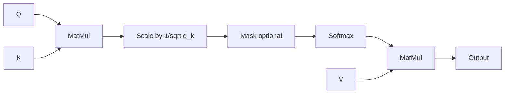

# Self-Attention Mechanism

The **Self-Attention Mechanism** (sometimes called intra-attention) is an attention mechanism that relates different positions of a single sequence in order to compute a representation of the same sequence. It was popularized by [[source-NIPS-2017-attention-is-all-you-need-Paper]] as the core building block of the [[transformer-architecture]].

## Mathematical Formulation

Self-attention maps a query ($Q$) and a set of key-value pairs ($K$, $V$) to an output. The output is computed as a weighted sum of the values, where the weight assigned to each value is computed by a compatibility function of the query with the corresponding key.

### Scaled Dot-Product Attention

In practice, the queries, keys, and values are packed into matrices $Q$, $K$, and $V$. The attention matrix is computed as follows:

$$\text{Attention}(Q, K, V) = \text{softmax}\left(\frac{QK^T}{\sqrt{d_k}}\right)V$$

Where:
- $d_k$ is the dimensionality of the queries and keys.
- $\frac{1}{\sqrt{d_k}}$ is the **Scale Factor**. Without scaling, for large values of $d_k$, the dot products grow large in magnitude, pushing the softmax function into regions with extremely small gradients.

### Multi-Head Attention

Instead of performing a single attention function with $d_{\text{model}}$-dimensional queries, keys, and values, **Multi-Head Attention** linearly projects the queries, keys, and values $h$ times with different, learned linear projections to $d_k$, $d_k$, and $d_v$ dimensions, respectively.

$$\text{MultiHead}(Q, K, V) = \text{Concat}(\text{head}_1, \dots, \text{head}_h)W^O$$
$$\text{where } \text{head}_i = \text{Attention}(QW_i^Q, KW_i^K, VW_i^V)$$

Where the projections are parameter matrices:
- $W_i^Q \in \mathbb{R}^{d_{\text{model}} \times d_k}$
- $W_i^K \in \mathbb{R}^{d_{\text{model}} \times d_k}$
- $W_i^V \in \mathbb{R}^{d_{\text{model}} \times d_v}$
- $W^O \in \mathbb{R}^{h d_v \times d_{\text{model}}}$

In the paper, $h = 8$ parallel attention heads are used, with $d_k = d_v = d_{\text{model}}/h = 64$.

## See Also

- [[transformer-architecture]]

## Sources

- [[source-NIPS-2017-attention-is-all-you-need-Paper]]
