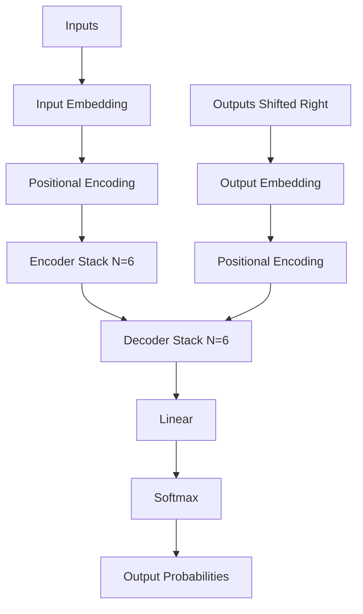

# Transformer Architecture

The **Transformer** is a deep learning architecture introduced by [[source-NIPS-2017-attention-is-all-you-need-Paper]]. It completely replaces recurrent neural networks (RNNs like LSTM/GRU) and convolutional neural networks (CNNs) for sequence processing, utilizing self-attention mechanisms to model global dependencies in parallel.

## Structural Overview

The model follows a classic encoder-decoder structure:

### 1. Encoder Stack
The encoder is composed of $N = 6$ identical layers. Each layer contains two main sub-layers:
1. A **Multi-Head Self-Attention** mechanism.
2. A simple, position-wise **Feed-Forward Network (FFN)**.

Each sub-layer is wrapped in a residual connection followed by layer normalization:
$$\text{LayerNorm}(x + \text{Sublayer}(x))$$
The output dimension of all sub-layers and embedding layers is $d_{\text{model}} = 512$.

### 2. Decoder Stack
The decoder is also composed of $N = 6$ identical layers. In addition to the two sub-layers found in the encoder, the decoder inserts a third sub-layer:
1. **Masked Multi-Head Self-Attention** to prevent positions from attending to subsequent positions (preserving the auto-regressive property).
2. **Encoder-Decoder Attention** where queries come from the previous decoder layer, and keys and values come from the encoder stack output.
3. A position-wise **Feed-Forward Network (FFN)**.

## Advantages of the Transformer

1. **Parallelization**: Unlike RNNs which compute sequentially position-by-position, the Transformer processes all tokens in the sequence simultaneously during training.
2. **Reduced Path Length**: Self-attention allows direct connections between any two positions in a sequence, reducing the maximum path length for learning long-range dependencies to $O(1)$.
3. **Training Efficiency**: Due to high parallelizability, it requires significantly less time and compute to train than recurrent counterparts.

## See Also

- [[self-attention-mechanism]]

## Sources

- [[source-NIPS-2017-attention-is-all-you-need-Paper]]
