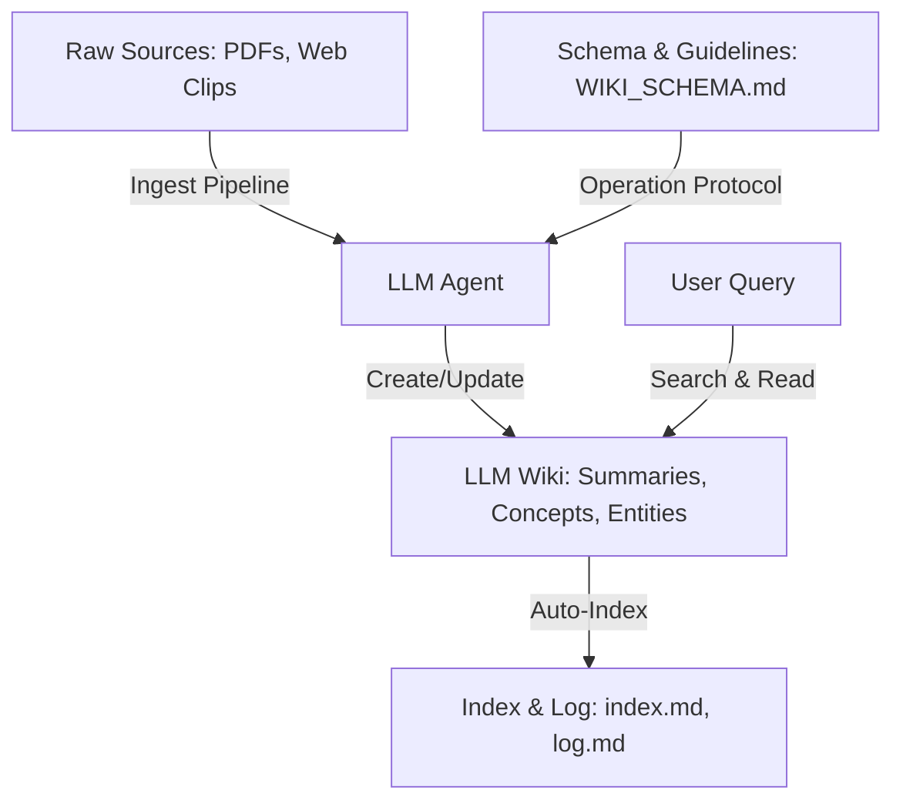

# LLM Wiki Pattern

## Overview

The **LLM Wiki Pattern** is a methodology for personal and team knowledge management. Unlike traditional Retrieval-Augmented Generation (RAG), which dynamically retrieves fragments from raw source documents at query time without maintaining any consolidated memory, the LLM Wiki pattern compiles knowledge into a persistent, structured, and cross-referenced directory of Markdown files.

An LLM agent is responsible for the manual labor of maintaining this wiki: ingesting new raw files, reconciling contradictory claims, establishing backlinks, and updating indices.

## Core Principles

1. **Persistent Compounding**: Knowledge is synthesized once at ingestion and stored in clean, focused concept and entity pages.
2. **AI-Managed Maintenance**: The LLM agent performs the tedious tasks of updating cross-references, indexing, and linting.
3. **Traceability**: All synthesized wiki pages reference back to their immutable raw sources via standard wikilinks.
4. **Bilingual Parallelism**: The vault is maintained in parallel languages (e.g., English and Indonesian) with reciprocal translation links.

## Comparison: RAG vs. LLM Wiki Pattern

| Attribute | Traditional RAG | LLM Wiki Pattern |
| :--- | :--- | :--- |
| **Storage Layer** | Vector database chunk embeddings | Structured, interlinked Markdown vault |
| **Synthesis Time** | Query time (ad-hoc) | Ingestion time (compiled & persistent) |
| **Cross-Referencing** | None (dynamic semantic retrieval) | Explicit wikilinks (e.g. `[ [Concept Name] ]`) |
| **Conflict Resolution** | Model resolves at query time (inconsistent) | Explicitly logged in contradiction blocks |
| **User Interface** | Single chat thread / list of chunks | Navigable Markdown vault (e.g., Obsidian) |

## Sources
- [[source-llm-wiki]]
