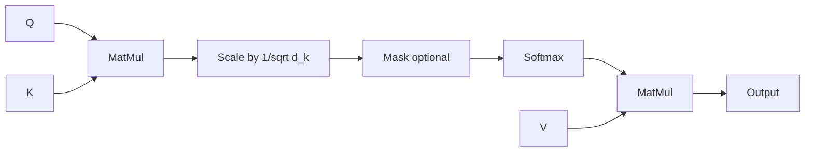

# Mekanisme Self-Attention

**Mekanisme Self-Attention** (kadang-kadang disebut intra-atensi) adalah mekanisme atensi yang menghubungkan posisi-posisi berbeda dari satu sekuens tunggal untuk menghitung representasi dari sekuens tersebut. Mekanisme ini dipopulerkan oleh [[source-NIPS-2017-attention-is-all-you-need-Paper-id]] sebagai blok pembangun inti dari [[transformer-architecture-id]].

## Formulasi Matematis

*Self-attention* memetakan *query* ($Q$) dan sekumpulan pasangan *key-value* ($K$, $V$) ke output. Output dihitung sebagai jumlah tertimbang (*weighted sum*) dari *values*, di mana bobot yang diberikan untuk setiap *value* dihitung oleh fungsi kompatibilitas dari *query* dengan *key* yang sesuai.

### Scaled Dot-Product Attention

Dalam praktiknya, *queries*, *keys*, dan *values* dikemas ke dalam matriks $Q$, $K$, dan $V$. Matriks atensi dihitung sebagai berikut:

$$\text{Attention}(Q, K, V) = \text{softmax}\left(\frac{QK^T}{\sqrt{d_k}}\right)V$$

Di mana:
- $d_k$ adalah dimensi dari *queries* dan *keys*.
- $\frac{1}{\sqrt{d_k}}$ adalah **Scale Factor**. Tanpa penskalaan (*scaling*), untuk nilai $d_k$ yang besar, hasil perkalian titik (*dot products*) akan tumbuh sangat besar, mendorong fungsi *softmax* ke wilayah dengan *gradient* yang sangat kecil.

### Multi-Head Attention

Alih-alih melakukan fungsi atensi tunggal dengan dimensi $d_{\text{model}}$ untuk *queries*, *keys*, dan *values*, **Multi-Head Attention** memproyeksikan secara linier *queries*, *keys*, dan *values* sebanyak $h$ kali dengan proyeksi linier berbeda yang dipelajari ke dimensi $d_k$, $d_k$, dan $d_v$ secara berturut-turut.

$$\text{MultiHead}(Q, K, V) = \text{Concat}(\text{head}_1, \dots, \text{head}_h)W^O$$
$$\text{where } \text{head}_i = \text{Attention}(QW_i^Q, KW_i^K, VW_i^V)$$

Di mana proyeksi tersebut adalah matriks parameter:
- $W_i^Q \in \mathbb{R}^{d_{\text{model}} \times d_k}$
- $W_i^K \in \mathbb{R}^{d_{\text{model}} \times d_k}$
- $W_i^V \in \mathbb{R}^{d_{\text{model}} \times d_v}$
- $W^O \in \mathbb{R}^{h d_v \times d_{\text{model}}}$

Dalam paper ini, digunakan $h = 8$ *attention heads* paralel, dengan $d_k = d_v = d_{\text{model}}/h = 64$.

## Lihat Juga

- [[transformer-architecture-id]]

## Sumber

- [[source-NIPS-2017-attention-is-all-you-need-Paper-id]]
