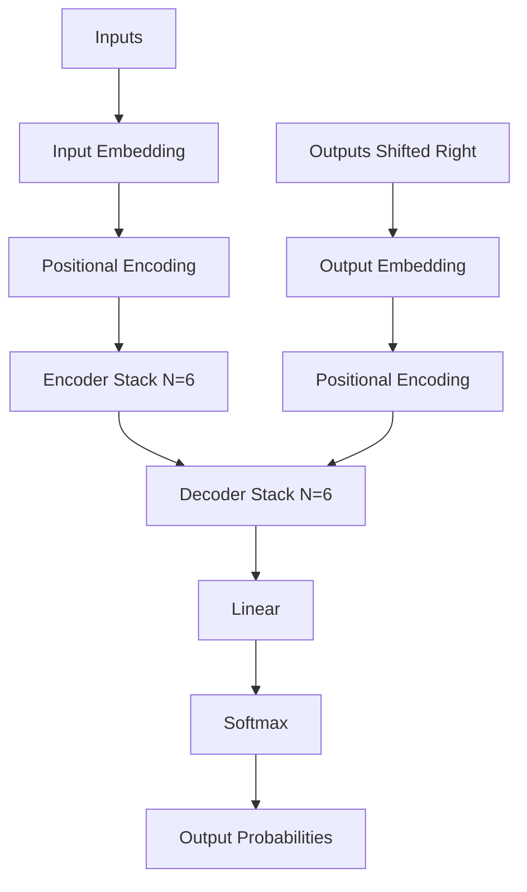

# Arsitektur Transformer

**Transformer** adalah arsitektur deep learning yang diperkenalkan oleh [[source-NIPS-2017-attention-is-all-you-need-Paper-id]]. Arsitektur ini sepenuhnya menggantikan recurrent neural networks (RNN seperti LSTM/GRU) dan convolutional neural networks (CNN) untuk pemrosesan sekuens, menggunakan mekanisme *self-attention* untuk memodelkan ketergantungan global secara paralel.

## Tinjauan Struktur

Model ini mengikuti struktur *encoder-decoder* klasik:

### 1. Encoder Stack
*Encoder* terdiri dari stack $N = 6$ lapisan yang identik. Setiap lapisan memiliki dua sub-lapisan (*sub-layers*) utama:
1. Mekanisme **Multi-Head Self-Attention**.
2. **Position-wise Feed-Forward Network (FFN)** yang sederhana.

Setiap sub-lapisan dibungkus dalam *residual connection* diikuti oleh *layer normalization*:
$$\text{LayerNorm}(x + \text{Sublayer}(x))$$
Dimensi output dari semua sub-lapisan dan lapisan *embedding* adalah $d_{\text{model}} = 512$.

### 2. Decoder Stack
*Decoder* juga terdiri dari stack $N = 6$ lapisan yang identik. Selain dua sub-lapisan yang ada pada *encoder*, *decoder* menyisipkan sub-lapisan ketiga:
1. **Masked Multi-Head Self-Attention** untuk mencegah posisi memperhatikan (*attend*) posisi berikutnya untuk menjaga properti *auto-regressive*.
2. **Encoder-Decoder Attention** di mana *queries* berasal dari lapisan *decoder* sebelumnya, sedangkan *keys* dan *values* berasal dari output stack *encoder*.
3. **Position-wise Feed-Forward Network (FFN)**.

## Keuntungan Transformer

1. **Parallelization**: Berbeda dengan RNN yang menghitung secara sekuensial posisi demi posisi, Transformer memproses semua *token* dalam sekuens secara bersamaan selama *training*.
2. **Path Length Terkikis**: *Self-attention* memungkinkan hubungan langsung antara dua posisi mana pun dalam sekuens, mengurangi panjang lintasan maksimum untuk mempelajari *long-range dependencies* menjadi $O(1)$.
3. **Efisiensi Training**: Karena kemampuan *parallelization* yang tinggi, Transformer membutuhkan waktu dan komputasi yang jauh lebih sedikit untuk *training* dibandingkan dengan model rekuren.

## Lihat Juga

- [[self-attention-mechanism-id]]

## Sumber

- [[source-NIPS-2017-attention-is-all-you-need-Paper-id]]
