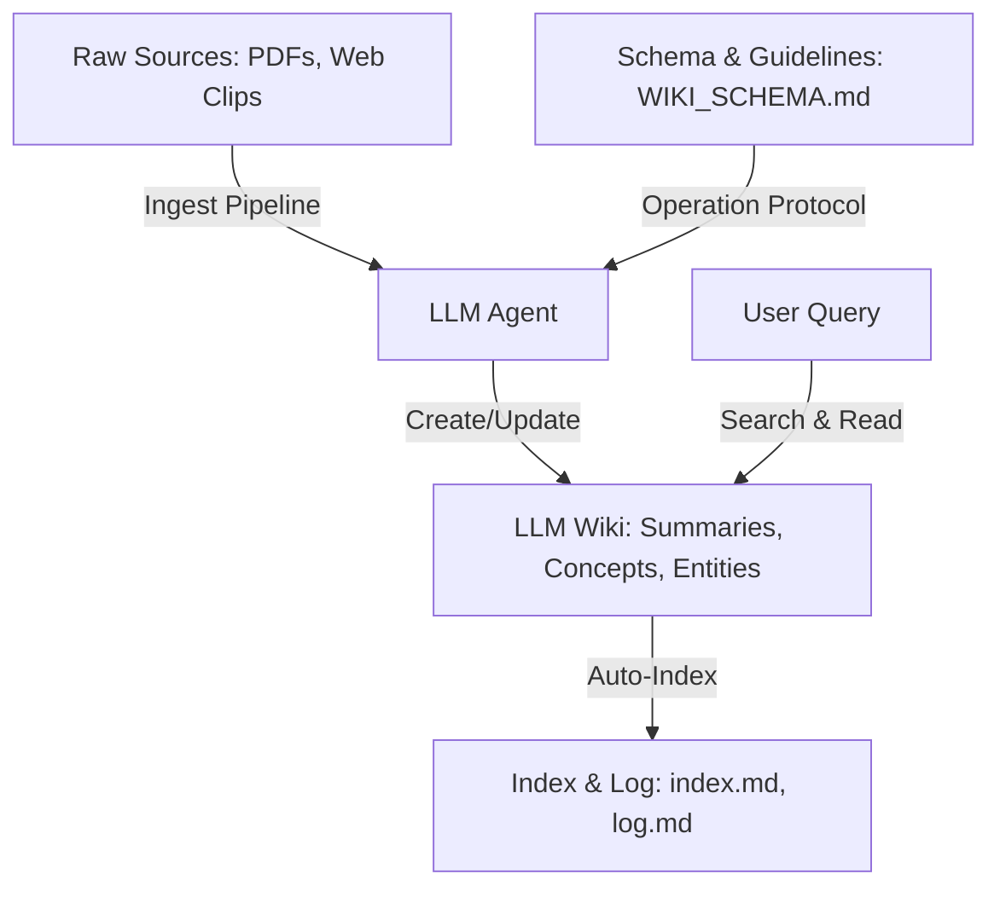

# Pola LLM Wiki (LLM Wiki Pattern)

## Tinjauan (Overview)

**LLM Wiki Pattern** adalah metodologi pengelolaan pengetahuan untuk pribadi maupun tim. Berbeda dengan Retrieval-Augmented Generation (RAG) tradisional yang mengambil fragmen dari dokumen sumber mentah secara dinamis pada saat kueri (*query time*) tanpa memelihara memori terkonsolidasi, LLM Wiki Pattern mengompilasi pengetahuan ke dalam direktori file Markdown yang persisten, terstruktur, dan memiliki referensi silang (*cross-referenced*).

Agen LLM bertanggung jawab atas pekerjaan manual dalam memelihara wiki ini: meng-*ingest* file mentah baru, merekonsiliasi klaim yang bertentangan (*contradictory claims*), membangun tautan balik (*backlinks*), dan memperbarui indeks.

## Prinsip Utama (Core Principles)

1. **Persistent Compounding**: Pengetahuan disintesis sekali saja saat *ingestion* dan disimpan dalam halaman konsep dan entitas yang bersih serta fokus.
2. **AI-Managed Maintenance**: Agen LLM melakukan tugas-tugas administratif yang membosankan seperti memperbarui referensi silang, *indexing*, dan *linting*.
3. **Traceability**: Semua halaman wiki yang disintesis merujuk kembali ke sumber mentah (*raw sources*) yang bersifat *immutable* melalui wikilink standar.
4. **Bilingual Parallelism**: Vault dipelihara dalam bahasa paralel (misalnya Inggris dan Indonesia) dengan tautan terjemahan timbal balik (*reciprocal translation links*).

## Perbandingan: RAG vs. LLM Wiki Pattern

| Atribut | RAG Tradisional | LLM Wiki Pattern |
| :--- | :--- | :--- |
| **Lapisan Penyimpanan** | Vector database chunk embeddings | Vault Markdown terstruktur dan saling tertaut |
| **Waktu Sintesis** | Query time (ad-hoc) | Ingestion time (dikompilasi & persisten) |
| **Referensi Silang** | Tidak ada (pengambilan semantik dinamis) | Wikilink eksplisit (seperti `[ [Concept Name] ]`) |
| **Resolusi Konflik** | Diselesaikan model saat kueri (tidak konsisten) | Dicatat secara eksplisit dalam blok kontradiksi |
| **User Interface** | Utas obrolan tunggal / daftar potongan teks | Vault Markdown yang dapat dinavigasi (mis. Obsidian) |

## Sumber
- [[source-llm-wiki-id]]
